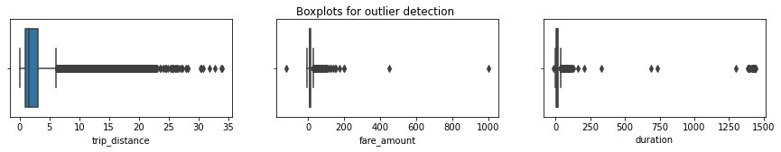
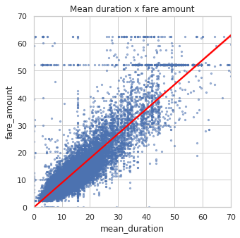
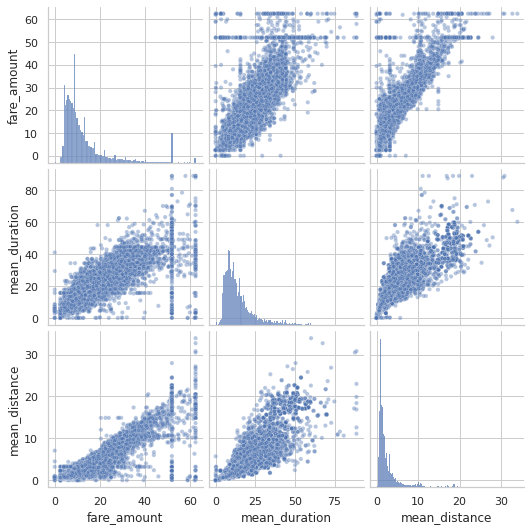
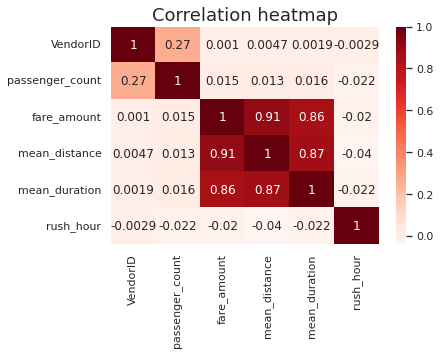
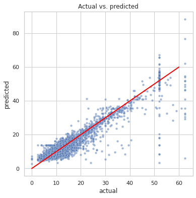
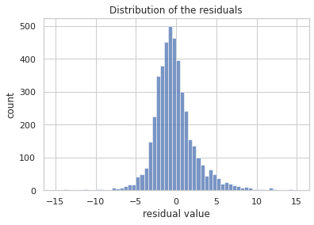
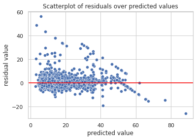

# **Automatidata Project Regression Analysis**


# Build a multiple linear regression model


# **PACE stages**


Throughout these project notebooks, you'll see references to the problem-solving framework PACE. The following notebook components are labeled with the respective PACE stage: Plan, Analyze, Construct, and Execute.


## PACE: **Plan**

Consider the questions in your PACE Strategy Document to reflect on the Plan stage.


### Imports and loading
Import the packages that you've learned are needed for building linear regression models.


```python
# Imports
# Packages for numerics + dataframes
import pandas as pd
import numpy as np

# Packages for visualization
import matplotlib.pyplot as plt
import seaborn as sns

# Packages for date conversions for calculating trip durations
from datetime import datetime
from datetime import date
from datetime import timedelta

# Packages for OLS, MLR, confusion matrix
from sklearn.preprocessing import StandardScaler
from sklearn.model_selection import train_test_split
import sklearn.metrics as metrics # For confusion matrix
from sklearn.linear_model import LinearRegression
from sklearn.metrics import mean_absolute_error,r2_score,mean_squared_error
```

**Note:** `Pandas` is used to load the NYC TLC dataset.  As shown in this cell, the dataset has been automatically loaded in for you. You do not need to download the .csv file, or provide more code, in order to access the dataset and proceed with this lab. Please continue with this activity by completing the following instructions.


```python
df0=pd.read_csv("2017_Yellow_Taxi_Trip_Data.csv")
```


## PACE: **Analyze**

In this stage, consider the following question where applicable to complete your code response:

* What are some purposes of EDA before constructing a multiple linear regression model?

1.   Outliers and extreme data values can significantly impact linear regression equations. After visualizing data, make a plan to identify outliers by dropping rows, substituting extreme data with average data, and/or removing data values greater than 3 standard deviations.

2.   EDA activities also include identifying missing data to help the analyst make decisions on their exclusion or inclusion by substituting values with data set means, medians, and other similar methods.

3.   It's important to check for things like multicollinearity between predictor variables, as well to understand their distributions, as this will help you decide what statistical inferences can be made from the model and which ones cannot.

4.  Additionally, it can be useful to engineer new features by multiplying variables together or taking the difference from one variable to another. 
### Explore data with EDA

Analyze and discover data, looking for correlations, missing data, outliers, and duplicates.

Start with `.shape` and `.info()`.


```python
# Start with `.shape` and `.info()`

# Keep `df0` as the original dataframe and create a copy (df) where changes will go
# Can revert `df` to `df0` if needed down the line
df = df0.copy()

# Display the dataset's shape
print(df.shape)

# Display basic info about the dataset
df.info()
```

    (22699, 18)
    <class 'pandas.core.frame.DataFrame'>
    RangeIndex: 22699 entries, 0 to 22698
    Data columns (total 18 columns):
     #   Column                 Non-Null Count  Dtype  
    ---  ------                 --------------  -----  
     0   Unnamed: 0             22699 non-null  int64  
     1   VendorID               22699 non-null  int64  
     2   tpep_pickup_datetime   22699 non-null  object 
     3   tpep_dropoff_datetime  22699 non-null  object 
     4   passenger_count        22699 non-null  int64  
     5   trip_distance          22699 non-null  float64
     6   RatecodeID             22699 non-null  int64  
     7   store_and_fwd_flag     22699 non-null  object 
     8   PULocationID           22699 non-null  int64  
     9   DOLocationID           22699 non-null  int64  
     10  payment_type           22699 non-null  int64  
     11  fare_amount            22699 non-null  float64
     12  extra                  22699 non-null  float64
     13  mta_tax                22699 non-null  float64
     14  tip_amount             22699 non-null  float64
     15  tolls_amount           22699 non-null  float64
     16  improvement_surcharge  22699 non-null  float64
     17  total_amount           22699 non-null  float64
    dtypes: float64(8), int64(7), object(3)
    memory usage: 3.1+ MB


Check for missing data and duplicates using `.isna()` and `.drop_duplicates()`.


```python
# Check for missing data and duplicates using .isna() and .drop_duplicates()
### YOUR CODE HERE ###

# Check for duplicates
print('Shape of dataframe:', df.shape)
print('Shape of dataframe with duplicates dropped:', df.drop_duplicates().shape)

# Check for missing values in dataframe
print('Total count of missing values:', df.isna().sum().sum())

# Display missing values per column in dataframe
print('Missing values per column:')
df.isna().sum()
```

    Shape of dataframe: (22699, 18)
    Shape of dataframe with duplicates dropped: (22699, 18)
    Total count of missing values: 0
    Missing values per column:


    Unnamed: 0               0
    VendorID                 0
    tpep_pickup_datetime     0
    tpep_dropoff_datetime    0
    passenger_count          0
    trip_distance            0
    RatecodeID               0
    store_and_fwd_flag       0
    PULocationID             0
    DOLocationID             0
    payment_type             0
    fare_amount              0
    extra                    0
    mta_tax                  0
    tip_amount               0
    tolls_amount             0
    improvement_surcharge    0
    total_amount             0
    dtype: int64


**Exemplar note:** There are no duplicates or missing values in the data.

Use `.describe()`.


```python
# Display descriptive stats about the data
df.describe()
```


<div>
<style scoped>
    .dataframe tbody tr th:only-of-type {
        vertical-align: middle;
    }

    .dataframe tbody tr th {
        vertical-align: top;
    }

    .dataframe thead th {
        text-align: right;
    }
</style>
<table border="1" class="dataframe">
  <thead>
    <tr style="text-align: right;">
      <th></th>
      <th>Unnamed: 0</th>
      <th>VendorID</th>
      <th>passenger_count</th>
      <th>trip_distance</th>
      <th>RatecodeID</th>
      <th>PULocationID</th>
      <th>DOLocationID</th>
      <th>payment_type</th>
      <th>fare_amount</th>
      <th>extra</th>
      <th>mta_tax</th>
      <th>tip_amount</th>
      <th>tolls_amount</th>
      <th>improvement_surcharge</th>
      <th>total_amount</th>
    </tr>
  </thead>
  <tbody>
    <tr>
      <th>count</th>
      <td>2.269900e+04</td>
      <td>22699.000000</td>
      <td>22699.000000</td>
      <td>22699.000000</td>
      <td>22699.000000</td>
      <td>22699.000000</td>
      <td>22699.000000</td>
      <td>22699.000000</td>
      <td>22699.000000</td>
      <td>22699.000000</td>
      <td>22699.000000</td>
      <td>22699.000000</td>
      <td>22699.000000</td>
      <td>22699.000000</td>
      <td>22699.000000</td>
    </tr>
    <tr>
      <th>mean</th>
      <td>5.675849e+07</td>
      <td>1.556236</td>
      <td>1.642319</td>
      <td>2.913313</td>
      <td>1.043394</td>
      <td>162.412353</td>
      <td>161.527997</td>
      <td>1.336887</td>
      <td>13.026629</td>
      <td>0.333275</td>
      <td>0.497445</td>
      <td>1.835781</td>
      <td>0.312542</td>
      <td>0.299551</td>
      <td>16.310502</td>
    </tr>
    <tr>
      <th>std</th>
      <td>3.274493e+07</td>
      <td>0.496838</td>
      <td>1.285231</td>
      <td>3.653171</td>
      <td>0.708391</td>
      <td>66.633373</td>
      <td>70.139691</td>
      <td>0.496211</td>
      <td>13.243791</td>
      <td>0.463097</td>
      <td>0.039465</td>
      <td>2.800626</td>
      <td>1.399212</td>
      <td>0.015673</td>
      <td>16.097295</td>
    </tr>
    <tr>
      <th>min</th>
      <td>1.212700e+04</td>
      <td>1.000000</td>
      <td>0.000000</td>
      <td>0.000000</td>
      <td>1.000000</td>
      <td>1.000000</td>
      <td>1.000000</td>
      <td>1.000000</td>
      <td>-120.000000</td>
      <td>-1.000000</td>
      <td>-0.500000</td>
      <td>0.000000</td>
      <td>0.000000</td>
      <td>-0.300000</td>
      <td>-120.300000</td>
    </tr>
    <tr>
      <th>25%</th>
      <td>2.852056e+07</td>
      <td>1.000000</td>
      <td>1.000000</td>
      <td>0.990000</td>
      <td>1.000000</td>
      <td>114.000000</td>
      <td>112.000000</td>
      <td>1.000000</td>
      <td>6.500000</td>
      <td>0.000000</td>
      <td>0.500000</td>
      <td>0.000000</td>
      <td>0.000000</td>
      <td>0.300000</td>
      <td>8.750000</td>
    </tr>
    <tr>
      <th>50%</th>
      <td>5.673150e+07</td>
      <td>2.000000</td>
      <td>1.000000</td>
      <td>1.610000</td>
      <td>1.000000</td>
      <td>162.000000</td>
      <td>162.000000</td>
      <td>1.000000</td>
      <td>9.500000</td>
      <td>0.000000</td>
      <td>0.500000</td>
      <td>1.350000</td>
      <td>0.000000</td>
      <td>0.300000</td>
      <td>11.800000</td>
    </tr>
    <tr>
      <th>75%</th>
      <td>8.537452e+07</td>
      <td>2.000000</td>
      <td>2.000000</td>
      <td>3.060000</td>
      <td>1.000000</td>
      <td>233.000000</td>
      <td>233.000000</td>
      <td>2.000000</td>
      <td>14.500000</td>
      <td>0.500000</td>
      <td>0.500000</td>
      <td>2.450000</td>
      <td>0.000000</td>
      <td>0.300000</td>
      <td>17.800000</td>
    </tr>
    <tr>
      <th>max</th>
      <td>1.134863e+08</td>
      <td>2.000000</td>
      <td>6.000000</td>
      <td>33.960000</td>
      <td>99.000000</td>
      <td>265.000000</td>
      <td>265.000000</td>
      <td>4.000000</td>
      <td>999.990000</td>
      <td>4.500000</td>
      <td>0.500000</td>
      <td>200.000000</td>
      <td>19.100000</td>
      <td>0.300000</td>
      <td>1200.290000</td>
    </tr>
  </tbody>
</table>
</div>


**Exemplar note:** Some things stand out from this table of summary statistics. For instance, there are clearly some outliers in several variables, like `tip_amount` (\$200) and `total_amount` (\$1,200). Also, a number of the variables, such as `mta_tax`, seem to be almost constant throughout the data, which would imply that they would not be expected to be very predictive.

### Convert pickup & dropoff columns to datetime


```python
# Check the format of the data
df['tpep_dropoff_datetime'][0]
```


    '03/25/2017 9:09:47 AM'


```python
# Convert datetime columns to datetime
# Display data types of `tpep_pickup_datetime`, `tpep_dropoff_datetime`
print('Data type of tpep_pickup_datetime:', df['tpep_pickup_datetime'].dtype)
print('Data type of tpep_dropoff_datetime:', df['tpep_dropoff_datetime'].dtype)

# Convert `tpep_pickup_datetime` to datetime format
df['tpep_pickup_datetime'] = pd.to_datetime(df['tpep_pickup_datetime'], format='%m/%d/%Y %I:%M:%S %p')

# Convert `tpep_dropoff_datetime` to datetime format
df['tpep_dropoff_datetime'] = pd.to_datetime(df['tpep_dropoff_datetime'], format='%m/%d/%Y %I:%M:%S %p')

# Display data types of `tpep_pickup_datetime`, `tpep_dropoff_datetime`
print('Data type of tpep_pickup_datetime:', df['tpep_pickup_datetime'].dtype)
print('Data type of tpep_dropoff_datetime:', df['tpep_dropoff_datetime'].dtype)

df.head(3)
```

    Data type of tpep_pickup_datetime: object
    Data type of tpep_dropoff_datetime: object
    Data type of tpep_pickup_datetime: datetime64[ns]
    Data type of tpep_dropoff_datetime: datetime64[ns]


<div>
<style scoped>
    .dataframe tbody tr th:only-of-type {
        vertical-align: middle;
    }

    .dataframe tbody tr th {
        vertical-align: top;
    }

    .dataframe thead th {
        text-align: right;
    }
</style>
<table border="1" class="dataframe">
  <thead>
    <tr style="text-align: right;">
      <th></th>
      <th>Unnamed: 0</th>
      <th>VendorID</th>
      <th>tpep_pickup_datetime</th>
      <th>tpep_dropoff_datetime</th>
      <th>passenger_count</th>
      <th>trip_distance</th>
      <th>RatecodeID</th>
      <th>store_and_fwd_flag</th>
      <th>PULocationID</th>
      <th>DOLocationID</th>
      <th>payment_type</th>
      <th>fare_amount</th>
      <th>extra</th>
      <th>mta_tax</th>
      <th>tip_amount</th>
      <th>tolls_amount</th>
      <th>improvement_surcharge</th>
      <th>total_amount</th>
    </tr>
  </thead>
  <tbody>
    <tr>
      <th>0</th>
      <td>24870114</td>
      <td>2</td>
      <td>2017-03-25 08:55:43</td>
      <td>2017-03-25 09:09:47</td>
      <td>6</td>
      <td>3.34</td>
      <td>1</td>
      <td>N</td>
      <td>100</td>
      <td>231</td>
      <td>1</td>
      <td>13.0</td>
      <td>0.0</td>
      <td>0.5</td>
      <td>2.76</td>
      <td>0.0</td>
      <td>0.3</td>
      <td>16.56</td>
    </tr>
    <tr>
      <th>1</th>
      <td>35634249</td>
      <td>1</td>
      <td>2017-04-11 14:53:28</td>
      <td>2017-04-11 15:19:58</td>
      <td>1</td>
      <td>1.80</td>
      <td>1</td>
      <td>N</td>
      <td>186</td>
      <td>43</td>
      <td>1</td>
      <td>16.0</td>
      <td>0.0</td>
      <td>0.5</td>
      <td>4.00</td>
      <td>0.0</td>
      <td>0.3</td>
      <td>20.80</td>
    </tr>
    <tr>
      <th>2</th>
      <td>106203690</td>
      <td>1</td>
      <td>2017-12-15 07:26:56</td>
      <td>2017-12-15 07:34:08</td>
      <td>1</td>
      <td>1.00</td>
      <td>1</td>
      <td>N</td>
      <td>262</td>
      <td>236</td>
      <td>1</td>
      <td>6.5</td>
      <td>0.0</td>
      <td>0.5</td>
      <td>1.45</td>
      <td>0.0</td>
      <td>0.3</td>
      <td>8.75</td>
    </tr>
  </tbody>
</table>
</div>


### Create duration column

Create a new column called `duration` that represents the total number of minutes that each taxi ride took.


```python
# Create `duration` column
df['duration'] = (df['tpep_dropoff_datetime'] - df['tpep_pickup_datetime'])/np.timedelta64(1,'m')
```

### Outliers

Call `df.info()` to inspect the columns and decide which ones to check for outliers.


```python
df.info()
```

    <class 'pandas.core.frame.DataFrame'>
    RangeIndex: 22699 entries, 0 to 22698
    Data columns (total 19 columns):
     #   Column                 Non-Null Count  Dtype         
    ---  ------                 --------------  -----         
     0   Unnamed: 0             22699 non-null  int64         
     1   VendorID               22699 non-null  int64         
     2   tpep_pickup_datetime   22699 non-null  datetime64[ns]
     3   tpep_dropoff_datetime  22699 non-null  datetime64[ns]
     4   passenger_count        22699 non-null  int64         
     5   trip_distance          22699 non-null  float64       
     6   RatecodeID             22699 non-null  int64         
     7   store_and_fwd_flag     22699 non-null  object        
     8   PULocationID           22699 non-null  int64         
     9   DOLocationID           22699 non-null  int64         
     10  payment_type           22699 non-null  int64         
     11  fare_amount            22699 non-null  float64       
     12  extra                  22699 non-null  float64       
     13  mta_tax                22699 non-null  float64       
     14  tip_amount             22699 non-null  float64       
     15  tolls_amount           22699 non-null  float64       
     16  improvement_surcharge  22699 non-null  float64       
     17  total_amount           22699 non-null  float64       
     18  duration               22699 non-null  float64       
    dtypes: datetime64[ns](2), float64(9), int64(7), object(1)
    memory usage: 3.3+ MB


Keeping in mind that many of the features will not be used to fit your model, the most important columns to check for outliers are likely to be:
* `trip_distance`
* `fare_amount`
* `duration`


### Box plots

Plot a box plot for each feature: `trip_distance`, `fare_amount`, `duration`.


```python
fig, axes = plt.subplots(1, 3, figsize=(15, 2))
fig.suptitle('Boxplots for outlier detection')
sns.boxplot(ax=axes[0], x=df['trip_distance'])
sns.boxplot(ax=axes[1], x=df['fare_amount'])
sns.boxplot(ax=axes[2], x=df['duration'])
plt.show();
```


    

    


**Exemplar response:** 
1. All three variables contain outliers. Some are extreme, but others not so much.

2. It's 30 miles from the southern tip of Staten Island to the northern end of Manhattan and that's in a straight line. With this knowledge and the distribution of the values in this column, it's reasonable to leave these values alone and not alter them. However, the values for `fare_amount` and `duration` definitely seem to have problematic outliers on the higher end.

3. Probably not for the latter two, but for `trip_distance` it might be okay.

### Imputations

#### `trip_distance` outliers

You know from the summary statistics that there are trip distances of 0. Are these reflective of erroneous data, or are they very short trips that get rounded down?

To check, sort the column values, eliminate duplicates, and inspect the least 10 values. Are they rounded values or precise values?


```python
# Are trip distances of 0 bad data or very short trips rounded down?
sorted(set(df['trip_distance']))[:10]
```


    [0.0, 0.01, 0.02, 0.03, 0.04, 0.05, 0.06, 0.07, 0.08, 0.09]


The distances are captured with a high degree of precision. However, it might be possible for trips to have distances of zero if a passenger summoned a taxi and then changed their mind. Besides, are there enough zero values in the data to pose a problem?

Calculate the count of rides where the `trip_distance` is zero.


```python
sum(df['trip_distance']==0)
```


    148


**Exemplar note:** 148 out of ~23,000 rides is relatively insignificant. You could impute it with a value of 0.01, but it's unlikely to have much of an effect on the model. Therefore, the `trip_distance` column will remain untouched with regard to outliers.

#### `fare_amount` outliers


```python
df['fare_amount'].describe()
```


    count    22699.000000
    mean        13.026629
    std         13.243791
    min       -120.000000
    25%          6.500000
    50%          9.500000
    75%         14.500000
    max        999.990000
    Name: fare_amount, dtype: float64


**Exemplar response:**

The range of values in the `fare_amount` column is large and the extremes don't make much sense.

* **Low values:** Negative values are problematic. Values of zero could be legitimate if the taxi logged a trip that was immediately canceled.

* **High values:** The maximum fare amount in this dataset is nearly \\$1,000, which seems very unlikely. High values for this feature can be capped based on intuition and statistics. The interquartile range (IQR) is \\$8. The standard formula of `Q3 + (1.5 * IQR)` yields \$26.50. That doesn't seem appropriate for the maximum fare cap. In this case, we'll use a factor of `6`, which results in a cap of $62.50.

Impute values less than $0 with `0`.


```python
# Impute values less than $0 with 0
df.loc[df['fare_amount'] < 0, 'fare_amount'] = 0
df['fare_amount'].min()
```


    0.0


Now impute the maximum value as `Q3 + (6 * IQR)`.


```python
def outlier_imputer(column_list, iqr_factor):
    '''
    Impute upper-limit values in specified columns based on their interquartile range.

    Arguments:
        column_list: A list of columns to iterate over
        iqr_factor: A number representing x in the formula:
                    Q3 + (x * IQR). Used to determine maximum threshold,
                    beyond which a point is considered an outlier.

    The IQR is computed for each column in column_list and values exceeding
    the upper threshold for each column are imputed with the upper threshold value.
    '''
    for col in column_list:
        # Reassign minimum to zero
        df.loc[df[col] < 0, col] = 0

        # Calculate upper threshold
        q1 = df[col].quantile(0.25)
        q3 = df[col].quantile(0.75)
        iqr = q3 - q1
        upper_threshold = q3 + (iqr_factor * iqr)
        print(col)
        print('q3:', q3)
        print('upper_threshold:', upper_threshold)

        # Reassign values > threshold to threshold
        df.loc[df[col] > upper_threshold, col] = upper_threshold
        print(df[col].describe())
        print()
```


```python
outlier_imputer(['fare_amount'], 6)
```

    fare_amount
    q3: 14.5
    upper_threshold: 62.5
    count    22699.000000
    mean        12.897913
    std         10.541137
    min          0.000000
    25%          6.500000
    50%          9.500000
    75%         14.500000
    max         62.500000
    Name: fare_amount, dtype: float64
    


#### `duration` outliers


```python
df['duration'].describe()
```


    count    22699.000000
    mean        17.013777
    std         61.996482
    min        -16.983333
    25%          6.650000
    50%         11.183333
    75%         18.383333
    max       1439.550000
    Name: duration, dtype: float64


The `duration` column has problematic values at both the lower and upper extremities.

* **Low values:** There should be no values that represent negative time. Impute all negative durations with `0`.

* **High values:** Impute high values the same way you imputed the high-end outliers for fares: `Q3 + (6 * IQR)`.


```python
# Impute a 0 for any negative values
df.loc[df['duration'] < 0, 'duration'] = 0
df['duration'].min()
```


    0.0


```python
# Impute the high outliers
outlier_imputer(['duration'], 6)
```

    duration
    q3: 18.383333333333333
    upper_threshold: 88.78333333333333
    count    22699.000000
    mean        14.460555
    std         11.947043
    min          0.000000
    25%          6.650000
    50%         11.183333
    75%         18.383333
    max         88.783333
    Name: duration, dtype: float64
    


### Feature engineering

#### Create `mean_distance` column

When deployed, the model will not know the duration of a trip until after the trip occurs, so you cannot train a model that uses this feature. However, you can use the statistics of trips you *do* know to generalize about ones you do not know.

In this step, create a column called `mean_distance` that captures the mean distance for each group of trips that share pickup and dropoff points.

For example, if your data were:

|Trip|Start|End|Distance|
|--: |:---:|:-:|    |
| 1  | A   | B | 1  |
| 2  | C   | D | 2  |
| 3  | A   | B |1.5 |
| 4  | D   | C | 3  |

The results should be:
```
A -> B: 1.25 miles
C -> D: 2 miles
D -> C: 3 miles
```

Notice that C -> D is not the same as D -> C. All trips that share a unique pair of start and end points get grouped and averaged.

Then, a new column `mean_distance` will be added where the value at each row is the average for all trips with those pickup and dropoff locations:

|Trip|Start|End|Distance|mean_distance|
|--: |:---:|:-:|  :--   |:--   |
| 1  | A   | B | 1      | 1.25 |
| 2  | C   | D | 2      | 2    |
| 3  | A   | B |1.5     | 1.25 |
| 4  | D   | C | 3      | 3    |


Begin by creating a helper column called `pickup_dropoff`, which contains the unique combination of pickup and dropoff location IDs for each row.

One way to do this is to convert the pickup and dropoff location IDs to strings and join them, separated by a space. The space is to ensure that, for example, a trip with pickup/dropoff points of 12 & 151 gets encoded differently than a trip with points 121 & 51.

So, the new column would look like this:

|Trip|Start|End|pickup_dropoff|
|--: |:---:|:-:|  :--         |
| 1  | A   | B | 'A B'        |
| 2  | C   | D | 'C D'        |
| 3  | A   | B | 'A B'        |
| 4  | D   | C | 'D C'        |


```python
# Create `pickup_dropoff` column
df['pickup_dropoff'] = df['PULocationID'].astype(str) + ' ' + df['DOLocationID'].astype(str)
df['pickup_dropoff'].head(2)
```


    0    100 231
    1     186 43
    Name: pickup_dropoff, dtype: object


Now, use a `groupby()` statement to group each row by the new `pickup_dropoff` column, compute the mean, and capture the values only in the `trip_distance` column. Assign the results to a variable named `grouped`.


```python
grouped = df.groupby('pickup_dropoff').mean(numeric_only=True)[['trip_distance']]
grouped[:5]
```


<div>
<style scoped>
    .dataframe tbody tr th:only-of-type {
        vertical-align: middle;
    }

    .dataframe tbody tr th {
        vertical-align: top;
    }

    .dataframe thead th {
        text-align: right;
    }
</style>
<table border="1" class="dataframe">
  <thead>
    <tr style="text-align: right;">
      <th></th>
      <th>trip_distance</th>
    </tr>
    <tr>
      <th>pickup_dropoff</th>
      <th></th>
    </tr>
  </thead>
  <tbody>
    <tr>
      <th>1 1</th>
      <td>2.433333</td>
    </tr>
    <tr>
      <th>10 148</th>
      <td>15.700000</td>
    </tr>
    <tr>
      <th>100 1</th>
      <td>16.890000</td>
    </tr>
    <tr>
      <th>100 100</th>
      <td>0.253333</td>
    </tr>
    <tr>
      <th>100 107</th>
      <td>1.180000</td>
    </tr>
  </tbody>
</table>
</div>


`grouped` is an object of the `DataFrame` class.

1. Convert it to a dictionary using the [`to_dict()`](https://pandas.pydata.org/docs/reference/api/pandas.DataFrame.to_dict.html) method. Assign the results to a variable called `grouped_dict`. This will result in a dictionary with a key of `trip_distance` whose values are another dictionary. The inner dictionary's keys are pickup/dropoff points and its values are mean distances. This is the information you want.

```
Example:
grouped_dict = {'trip_distance': {'A B': 1.25, 'C D': 2, 'D C': 3}
```

2. Reassign the `grouped_dict` dictionary so it contains only the inner dictionary. In other words, get rid of `trip_distance` as a key, so:

```
Example:
grouped_dict = {'A B': 1.25, 'C D': 2, 'D C': 3}
 ```


```python
# 1. Convert `grouped` to a dictionary
grouped_dict = grouped.to_dict()

# 2. Reassign to only contain the inner dictionary
grouped_dict = grouped_dict['trip_distance']
```

1. Create a `mean_distance` column that is a copy of the `pickup_dropoff` helper column.

2. Use the [`map()`](https://pandas.pydata.org/docs/reference/api/pandas.Series.map.html#pandas-series-map) method on the `mean_distance` series. Pass `grouped_dict` as its argument. Reassign the result back to the `mean_distance` series.
</br></br>
When you pass a dictionary to the `Series.map()` method, it will replace the data in the series where that data matches the dictionary's keys. The values that get imputed are the values of the dictionary.

```
Example:
df['mean_distance']
```

|mean_distance |
|  :-:         |
| 'A B'        |
| 'C D'        |
| 'A B'        |
| 'D C'        |
| 'E F'        |

```
grouped_dict = {'A B': 1.25, 'C D': 2, 'D C': 3}
df['mean_distance`] = df['mean_distance'].map(grouped_dict)
df['mean_distance']
```

|mean_distance |
|  :-:         |
| 1.25         |
| 2            |
| 1.25         |
| 3            |
| NaN          |

When used this way, the `map()` `Series` method is very similar to `replace()`, however, note that `map()` will impute `NaN` for any values in the series that do not have a corresponding key in the mapping dictionary, so be careful.


```python
# 1. Create a mean_distance column that is a copy of the pickup_dropoff helper column
df['mean_distance'] = df['pickup_dropoff']

# 2. Map `grouped_dict` to the `mean_distance` column
df['mean_distance'] = df['mean_distance'].map(grouped_dict)

# Confirm that it worked
df[(df['PULocationID']==100) & (df['DOLocationID']==231)][['mean_distance']]
```


<div>
<style scoped>
    .dataframe tbody tr th:only-of-type {
        vertical-align: middle;
    }

    .dataframe tbody tr th {
        vertical-align: top;
    }

    .dataframe thead th {
        text-align: right;
    }
</style>
<table border="1" class="dataframe">
  <thead>
    <tr style="text-align: right;">
      <th></th>
      <th>mean_distance</th>
    </tr>
  </thead>
  <tbody>
    <tr>
      <th>0</th>
      <td>3.521667</td>
    </tr>
    <tr>
      <th>4909</th>
      <td>3.521667</td>
    </tr>
    <tr>
      <th>16636</th>
      <td>3.521667</td>
    </tr>
    <tr>
      <th>18134</th>
      <td>3.521667</td>
    </tr>
    <tr>
      <th>19761</th>
      <td>3.521667</td>
    </tr>
    <tr>
      <th>20581</th>
      <td>3.521667</td>
    </tr>
  </tbody>
</table>
</div>


#### Create `mean_duration` column

Repeat the process used to create the `mean_distance` column to create a `mean_duration` column.


```python
grouped = df.groupby('pickup_dropoff').mean(numeric_only=True)[['duration']]
grouped

# Create a dictionary where keys are unique pickup_dropoffs and values are
# mean trip duration for all trips with those pickup_dropoff combos
grouped_dict = grouped.to_dict()
grouped_dict = grouped_dict['duration']

df['mean_duration'] = df['pickup_dropoff']
df['mean_duration'] = df['mean_duration'].map(grouped_dict)

# Confirm that it worked
df[(df['PULocationID']==100) & (df['DOLocationID']==231)][['mean_duration']]
```


<div>
<style scoped>
    .dataframe tbody tr th:only-of-type {
        vertical-align: middle;
    }

    .dataframe tbody tr th {
        vertical-align: top;
    }

    .dataframe thead th {
        text-align: right;
    }
</style>
<table border="1" class="dataframe">
  <thead>
    <tr style="text-align: right;">
      <th></th>
      <th>mean_duration</th>
    </tr>
  </thead>
  <tbody>
    <tr>
      <th>0</th>
      <td>22.847222</td>
    </tr>
    <tr>
      <th>4909</th>
      <td>22.847222</td>
    </tr>
    <tr>
      <th>16636</th>
      <td>22.847222</td>
    </tr>
    <tr>
      <th>18134</th>
      <td>22.847222</td>
    </tr>
    <tr>
      <th>19761</th>
      <td>22.847222</td>
    </tr>
    <tr>
      <th>20581</th>
      <td>22.847222</td>
    </tr>
  </tbody>
</table>
</div>


#### Create `day` and `month` columns

Create two new columns, `day` (name of day) and `month` (name of month) by extracting the relevant information from the `tpep_pickup_datetime` column.


```python
# Create 'day' col
df['day'] = df['tpep_pickup_datetime'].dt.day_name().str.lower()

# Create 'month' col
df['month'] = df['tpep_pickup_datetime'].dt.strftime('%b').str.lower()
```

#### Create `rush_hour` column

Define rush hour as:
* Any weekday (not Saturday or Sunday) AND
* Either from 06:00&ndash;10:00 or from 16:00&ndash;20:00

Create a binary `rush_hour` column that contains a 1 if the ride was during rush hour and a 0 if it was not.


```python
# Create 'rush_hour' col
df['rush_hour'] = df['tpep_pickup_datetime'].dt.hour

# If day is Saturday or Sunday, impute 0 in `rush_hour` column
df.loc[df['day'].isin(['saturday', 'sunday']), 'rush_hour'] = 0
```


```python
def rush_hourizer(hour):
    if 6 <= hour['rush_hour'] < 10:
        val = 1
    elif 16 <= hour['rush_hour'] < 20:
        val = 1
    else:
        val = 0
    return val
```


```python
# Apply the `rush_hourizer()` function to the new column
df.loc[(df.day != 'saturday') & (df.day != 'sunday'), 'rush_hour'] = df.apply(rush_hourizer, axis=1)
df.head()
```


<div>
<style scoped>
    .dataframe tbody tr th:only-of-type {
        vertical-align: middle;
    }

    .dataframe tbody tr th {
        vertical-align: top;
    }

    .dataframe thead th {
        text-align: right;
    }
</style>
<table border="1" class="dataframe">
  <thead>
    <tr style="text-align: right;">
      <th></th>
      <th>Unnamed: 0</th>
      <th>VendorID</th>
      <th>tpep_pickup_datetime</th>
      <th>tpep_dropoff_datetime</th>
      <th>passenger_count</th>
      <th>trip_distance</th>
      <th>RatecodeID</th>
      <th>store_and_fwd_flag</th>
      <th>PULocationID</th>
      <th>DOLocationID</th>
      <th>...</th>
      <th>tolls_amount</th>
      <th>improvement_surcharge</th>
      <th>total_amount</th>
      <th>duration</th>
      <th>pickup_dropoff</th>
      <th>mean_distance</th>
      <th>mean_duration</th>
      <th>day</th>
      <th>month</th>
      <th>rush_hour</th>
    </tr>
  </thead>
  <tbody>
    <tr>
      <th>0</th>
      <td>24870114</td>
      <td>2</td>
      <td>2017-03-25 08:55:43</td>
      <td>2017-03-25 09:09:47</td>
      <td>6</td>
      <td>3.34</td>
      <td>1</td>
      <td>N</td>
      <td>100</td>
      <td>231</td>
      <td>...</td>
      <td>0.0</td>
      <td>0.3</td>
      <td>16.56</td>
      <td>14.066667</td>
      <td>100 231</td>
      <td>3.521667</td>
      <td>22.847222</td>
      <td>saturday</td>
      <td>mar</td>
      <td>0</td>
    </tr>
    <tr>
      <th>1</th>
      <td>35634249</td>
      <td>1</td>
      <td>2017-04-11 14:53:28</td>
      <td>2017-04-11 15:19:58</td>
      <td>1</td>
      <td>1.80</td>
      <td>1</td>
      <td>N</td>
      <td>186</td>
      <td>43</td>
      <td>...</td>
      <td>0.0</td>
      <td>0.3</td>
      <td>20.80</td>
      <td>26.500000</td>
      <td>186 43</td>
      <td>3.108889</td>
      <td>24.470370</td>
      <td>tuesday</td>
      <td>apr</td>
      <td>0</td>
    </tr>
    <tr>
      <th>2</th>
      <td>106203690</td>
      <td>1</td>
      <td>2017-12-15 07:26:56</td>
      <td>2017-12-15 07:34:08</td>
      <td>1</td>
      <td>1.00</td>
      <td>1</td>
      <td>N</td>
      <td>262</td>
      <td>236</td>
      <td>...</td>
      <td>0.0</td>
      <td>0.3</td>
      <td>8.75</td>
      <td>7.200000</td>
      <td>262 236</td>
      <td>0.881429</td>
      <td>7.250000</td>
      <td>friday</td>
      <td>dec</td>
      <td>1</td>
    </tr>
    <tr>
      <th>3</th>
      <td>38942136</td>
      <td>2</td>
      <td>2017-05-07 13:17:59</td>
      <td>2017-05-07 13:48:14</td>
      <td>1</td>
      <td>3.70</td>
      <td>1</td>
      <td>N</td>
      <td>188</td>
      <td>97</td>
      <td>...</td>
      <td>0.0</td>
      <td>0.3</td>
      <td>27.69</td>
      <td>30.250000</td>
      <td>188 97</td>
      <td>3.700000</td>
      <td>30.250000</td>
      <td>sunday</td>
      <td>may</td>
      <td>0</td>
    </tr>
    <tr>
      <th>4</th>
      <td>30841670</td>
      <td>2</td>
      <td>2017-04-15 23:32:20</td>
      <td>2017-04-15 23:49:03</td>
      <td>1</td>
      <td>4.37</td>
      <td>1</td>
      <td>N</td>
      <td>4</td>
      <td>112</td>
      <td>...</td>
      <td>0.0</td>
      <td>0.3</td>
      <td>17.80</td>
      <td>16.716667</td>
      <td>4 112</td>
      <td>4.435000</td>
      <td>14.616667</td>
      <td>saturday</td>
      <td>apr</td>
      <td>0</td>
    </tr>
  </tbody>
</table>
<p>5 rows × 25 columns</p>
</div>


### Scatter plot

Create a scatterplot to visualize the relationship between `mean_duration` and `fare_amount`.


```python
# Create a scatter plot of duration and trip_distance, with a line of best fit
sns.set(style='whitegrid')
f = plt.figure()
f.set_figwidth(5)
f.set_figheight(5)
sns.regplot(x=df['mean_duration'], y=df['fare_amount'],
            scatter_kws={'alpha':0.5, 's':5},
            line_kws={'color':'red'})
plt.ylim(0, 70)
plt.xlim(0, 70)
plt.title('Mean duration x fare amount')
plt.show()
```


    

    


The `mean_duration` variable correlates with the target variable. But what are the horizontal lines around fare amounts of 52 dollars and 63 dollars? What are the values and how many are there?

You know what one of the lines represents. 62 dollars and 50 cents is the maximum that was imputed for outliers, so all former outliers will now have fare amounts of \$62.50. What is the other line?

Check the value of the rides in the second horizontal line in the scatter plot.


```python
df[df['fare_amount'] > 50]['fare_amount'].value_counts().head()
```


    52.0    514
    62.5     84
    59.0      9
    50.5      9
    57.5      8
    Name: fare_amount, dtype: int64


**Exemplar note:** There are 514 trips whose fares were \$52.

Examine the first 30 of these trips.


```python
# Set pandas to display all columns
pd.set_option('display.max_columns', None)
df[df['fare_amount']==52].head(30)
```


<div>
<style scoped>
    .dataframe tbody tr th:only-of-type {
        vertical-align: middle;
    }

    .dataframe tbody tr th {
        vertical-align: top;
    }

    .dataframe thead th {
        text-align: right;
    }
</style>
<table border="1" class="dataframe">
  <thead>
    <tr style="text-align: right;">
      <th></th>
      <th>Unnamed: 0</th>
      <th>VendorID</th>
      <th>tpep_pickup_datetime</th>
      <th>tpep_dropoff_datetime</th>
      <th>passenger_count</th>
      <th>trip_distance</th>
      <th>RatecodeID</th>
      <th>store_and_fwd_flag</th>
      <th>PULocationID</th>
      <th>DOLocationID</th>
      <th>payment_type</th>
      <th>fare_amount</th>
      <th>extra</th>
      <th>mta_tax</th>
      <th>tip_amount</th>
      <th>tolls_amount</th>
      <th>improvement_surcharge</th>
      <th>total_amount</th>
      <th>duration</th>
      <th>pickup_dropoff</th>
      <th>mean_distance</th>
      <th>mean_duration</th>
      <th>day</th>
      <th>month</th>
      <th>rush_hour</th>
    </tr>
  </thead>
  <tbody>
    <tr>
      <th>11</th>
      <td>18600059</td>
      <td>2</td>
      <td>2017-03-05 19:15:30</td>
      <td>2017-03-05 19:52:18</td>
      <td>2</td>
      <td>18.90</td>
      <td>2</td>
      <td>N</td>
      <td>236</td>
      <td>132</td>
      <td>1</td>
      <td>52.0</td>
      <td>0.0</td>
      <td>0.5</td>
      <td>14.58</td>
      <td>5.54</td>
      <td>0.3</td>
      <td>72.92</td>
      <td>36.800000</td>
      <td>236 132</td>
      <td>19.211667</td>
      <td>40.500000</td>
      <td>sunday</td>
      <td>mar</td>
      <td>0</td>
    </tr>
    <tr>
      <th>110</th>
      <td>47959795</td>
      <td>1</td>
      <td>2017-06-03 14:24:57</td>
      <td>2017-06-03 15:31:48</td>
      <td>1</td>
      <td>18.00</td>
      <td>2</td>
      <td>N</td>
      <td>132</td>
      <td>163</td>
      <td>1</td>
      <td>52.0</td>
      <td>0.0</td>
      <td>0.5</td>
      <td>0.00</td>
      <td>0.00</td>
      <td>0.3</td>
      <td>52.80</td>
      <td>66.850000</td>
      <td>132 163</td>
      <td>19.229000</td>
      <td>52.941667</td>
      <td>saturday</td>
      <td>jun</td>
      <td>0</td>
    </tr>
    <tr>
      <th>161</th>
      <td>95729204</td>
      <td>2</td>
      <td>2017-11-11 20:16:16</td>
      <td>2017-11-11 20:17:14</td>
      <td>1</td>
      <td>0.23</td>
      <td>2</td>
      <td>N</td>
      <td>132</td>
      <td>132</td>
      <td>2</td>
      <td>52.0</td>
      <td>0.0</td>
      <td>0.5</td>
      <td>0.00</td>
      <td>0.00</td>
      <td>0.3</td>
      <td>52.80</td>
      <td>0.966667</td>
      <td>132 132</td>
      <td>2.255862</td>
      <td>3.021839</td>
      <td>saturday</td>
      <td>nov</td>
      <td>0</td>
    </tr>
    <tr>
      <th>247</th>
      <td>103404868</td>
      <td>2</td>
      <td>2017-12-06 23:37:08</td>
      <td>2017-12-07 00:06:19</td>
      <td>1</td>
      <td>18.93</td>
      <td>2</td>
      <td>N</td>
      <td>132</td>
      <td>79</td>
      <td>2</td>
      <td>52.0</td>
      <td>0.0</td>
      <td>0.5</td>
      <td>0.00</td>
      <td>0.00</td>
      <td>0.3</td>
      <td>52.80</td>
      <td>29.183333</td>
      <td>132 79</td>
      <td>19.431667</td>
      <td>47.275000</td>
      <td>wednesday</td>
      <td>dec</td>
      <td>0</td>
    </tr>
    <tr>
      <th>379</th>
      <td>80479432</td>
      <td>2</td>
      <td>2017-09-24 23:45:45</td>
      <td>2017-09-25 00:15:14</td>
      <td>1</td>
      <td>17.99</td>
      <td>2</td>
      <td>N</td>
      <td>132</td>
      <td>234</td>
      <td>1</td>
      <td>52.0</td>
      <td>0.0</td>
      <td>0.5</td>
      <td>14.64</td>
      <td>5.76</td>
      <td>0.3</td>
      <td>73.20</td>
      <td>29.483333</td>
      <td>132 234</td>
      <td>17.654000</td>
      <td>49.833333</td>
      <td>sunday</td>
      <td>sep</td>
      <td>0</td>
    </tr>
    <tr>
      <th>388</th>
      <td>16226157</td>
      <td>1</td>
      <td>2017-02-28 18:30:05</td>
      <td>2017-02-28 19:09:55</td>
      <td>1</td>
      <td>18.40</td>
      <td>2</td>
      <td>N</td>
      <td>132</td>
      <td>48</td>
      <td>2</td>
      <td>52.0</td>
      <td>4.5</td>
      <td>0.5</td>
      <td>0.00</td>
      <td>5.54</td>
      <td>0.3</td>
      <td>62.84</td>
      <td>39.833333</td>
      <td>132 48</td>
      <td>18.761905</td>
      <td>58.246032</td>
      <td>tuesday</td>
      <td>feb</td>
      <td>1</td>
    </tr>
    <tr>
      <th>406</th>
      <td>55253442</td>
      <td>2</td>
      <td>2017-06-05 12:51:58</td>
      <td>2017-06-05 13:07:35</td>
      <td>1</td>
      <td>4.73</td>
      <td>2</td>
      <td>N</td>
      <td>228</td>
      <td>88</td>
      <td>2</td>
      <td>52.0</td>
      <td>0.0</td>
      <td>0.5</td>
      <td>0.00</td>
      <td>5.76</td>
      <td>0.3</td>
      <td>58.56</td>
      <td>15.616667</td>
      <td>228 88</td>
      <td>4.730000</td>
      <td>15.616667</td>
      <td>monday</td>
      <td>jun</td>
      <td>0</td>
    </tr>
    <tr>
      <th>449</th>
      <td>65900029</td>
      <td>2</td>
      <td>2017-08-03 22:47:14</td>
      <td>2017-08-03 23:32:41</td>
      <td>2</td>
      <td>18.21</td>
      <td>2</td>
      <td>N</td>
      <td>132</td>
      <td>48</td>
      <td>2</td>
      <td>52.0</td>
      <td>0.0</td>
      <td>0.5</td>
      <td>0.00</td>
      <td>5.76</td>
      <td>0.3</td>
      <td>58.56</td>
      <td>45.450000</td>
      <td>132 48</td>
      <td>18.761905</td>
      <td>58.246032</td>
      <td>thursday</td>
      <td>aug</td>
      <td>0</td>
    </tr>
    <tr>
      <th>468</th>
      <td>80904240</td>
      <td>2</td>
      <td>2017-09-26 13:48:26</td>
      <td>2017-09-26 14:31:17</td>
      <td>1</td>
      <td>17.27</td>
      <td>2</td>
      <td>N</td>
      <td>186</td>
      <td>132</td>
      <td>2</td>
      <td>52.0</td>
      <td>0.0</td>
      <td>0.5</td>
      <td>0.00</td>
      <td>5.76</td>
      <td>0.3</td>
      <td>58.56</td>
      <td>42.850000</td>
      <td>186 132</td>
      <td>17.096000</td>
      <td>42.920000</td>
      <td>tuesday</td>
      <td>sep</td>
      <td>0</td>
    </tr>
    <tr>
      <th>520</th>
      <td>33706214</td>
      <td>2</td>
      <td>2017-04-23 21:34:48</td>
      <td>2017-04-23 22:46:23</td>
      <td>6</td>
      <td>18.34</td>
      <td>2</td>
      <td>N</td>
      <td>132</td>
      <td>148</td>
      <td>1</td>
      <td>52.0</td>
      <td>0.0</td>
      <td>0.5</td>
      <td>5.00</td>
      <td>0.00</td>
      <td>0.3</td>
      <td>57.80</td>
      <td>71.583333</td>
      <td>132 148</td>
      <td>17.994286</td>
      <td>46.340476</td>
      <td>sunday</td>
      <td>apr</td>
      <td>0</td>
    </tr>
    <tr>
      <th>569</th>
      <td>99259872</td>
      <td>2</td>
      <td>2017-11-22 21:31:32</td>
      <td>2017-11-22 22:00:25</td>
      <td>1</td>
      <td>18.65</td>
      <td>2</td>
      <td>N</td>
      <td>132</td>
      <td>144</td>
      <td>1</td>
      <td>52.0</td>
      <td>0.0</td>
      <td>0.5</td>
      <td>10.56</td>
      <td>0.00</td>
      <td>0.3</td>
      <td>63.36</td>
      <td>28.883333</td>
      <td>132 144</td>
      <td>18.537500</td>
      <td>37.000000</td>
      <td>wednesday</td>
      <td>nov</td>
      <td>0</td>
    </tr>
    <tr>
      <th>572</th>
      <td>61050418</td>
      <td>2</td>
      <td>2017-07-18 13:29:06</td>
      <td>2017-07-18 13:29:19</td>
      <td>1</td>
      <td>0.00</td>
      <td>2</td>
      <td>N</td>
      <td>230</td>
      <td>161</td>
      <td>1</td>
      <td>52.0</td>
      <td>0.0</td>
      <td>0.5</td>
      <td>11.71</td>
      <td>5.76</td>
      <td>0.3</td>
      <td>70.27</td>
      <td>0.216667</td>
      <td>230 161</td>
      <td>0.685484</td>
      <td>7.965591</td>
      <td>tuesday</td>
      <td>jul</td>
      <td>0</td>
    </tr>
    <tr>
      <th>586</th>
      <td>54444647</td>
      <td>2</td>
      <td>2017-06-26 13:39:12</td>
      <td>2017-06-26 14:34:54</td>
      <td>1</td>
      <td>17.76</td>
      <td>2</td>
      <td>N</td>
      <td>211</td>
      <td>132</td>
      <td>1</td>
      <td>52.0</td>
      <td>0.0</td>
      <td>0.5</td>
      <td>11.71</td>
      <td>5.76</td>
      <td>0.3</td>
      <td>70.27</td>
      <td>55.700000</td>
      <td>211 132</td>
      <td>16.580000</td>
      <td>61.691667</td>
      <td>monday</td>
      <td>jun</td>
      <td>0</td>
    </tr>
    <tr>
      <th>692</th>
      <td>94424289</td>
      <td>2</td>
      <td>2017-11-07 22:15:00</td>
      <td>2017-11-07 22:45:32</td>
      <td>2</td>
      <td>16.97</td>
      <td>2</td>
      <td>N</td>
      <td>132</td>
      <td>170</td>
      <td>1</td>
      <td>52.0</td>
      <td>0.0</td>
      <td>0.5</td>
      <td>11.71</td>
      <td>5.76</td>
      <td>0.3</td>
      <td>70.27</td>
      <td>30.533333</td>
      <td>132 170</td>
      <td>17.203000</td>
      <td>37.113333</td>
      <td>tuesday</td>
      <td>nov</td>
      <td>0</td>
    </tr>
    <tr>
      <th>717</th>
      <td>103094220</td>
      <td>1</td>
      <td>2017-12-06 05:19:50</td>
      <td>2017-12-06 05:53:52</td>
      <td>1</td>
      <td>20.80</td>
      <td>2</td>
      <td>N</td>
      <td>132</td>
      <td>239</td>
      <td>1</td>
      <td>52.0</td>
      <td>0.0</td>
      <td>0.5</td>
      <td>5.85</td>
      <td>5.76</td>
      <td>0.3</td>
      <td>64.41</td>
      <td>34.033333</td>
      <td>132 239</td>
      <td>20.901250</td>
      <td>44.862500</td>
      <td>wednesday</td>
      <td>dec</td>
      <td>0</td>
    </tr>
    <tr>
      <th>719</th>
      <td>66115834</td>
      <td>1</td>
      <td>2017-08-04 17:53:34</td>
      <td>2017-08-04 18:50:56</td>
      <td>1</td>
      <td>21.60</td>
      <td>2</td>
      <td>N</td>
      <td>264</td>
      <td>264</td>
      <td>1</td>
      <td>52.0</td>
      <td>4.5</td>
      <td>0.5</td>
      <td>12.60</td>
      <td>5.76</td>
      <td>0.3</td>
      <td>75.66</td>
      <td>57.366667</td>
      <td>264 264</td>
      <td>3.191516</td>
      <td>15.618773</td>
      <td>friday</td>
      <td>aug</td>
      <td>1</td>
    </tr>
    <tr>
      <th>782</th>
      <td>55934137</td>
      <td>2</td>
      <td>2017-06-09 09:31:25</td>
      <td>2017-06-09 10:24:10</td>
      <td>2</td>
      <td>18.81</td>
      <td>2</td>
      <td>N</td>
      <td>163</td>
      <td>132</td>
      <td>1</td>
      <td>52.0</td>
      <td>0.0</td>
      <td>0.5</td>
      <td>13.20</td>
      <td>0.00</td>
      <td>0.3</td>
      <td>66.00</td>
      <td>52.750000</td>
      <td>163 132</td>
      <td>17.275833</td>
      <td>52.338889</td>
      <td>friday</td>
      <td>jun</td>
      <td>1</td>
    </tr>
    <tr>
      <th>816</th>
      <td>13731926</td>
      <td>2</td>
      <td>2017-02-21 06:11:03</td>
      <td>2017-02-21 06:59:39</td>
      <td>5</td>
      <td>16.94</td>
      <td>2</td>
      <td>N</td>
      <td>132</td>
      <td>170</td>
      <td>1</td>
      <td>52.0</td>
      <td>0.0</td>
      <td>0.5</td>
      <td>2.00</td>
      <td>5.54</td>
      <td>0.3</td>
      <td>60.34</td>
      <td>48.600000</td>
      <td>132 170</td>
      <td>17.203000</td>
      <td>37.113333</td>
      <td>tuesday</td>
      <td>feb</td>
      <td>1</td>
    </tr>
    <tr>
      <th>818</th>
      <td>52277743</td>
      <td>2</td>
      <td>2017-06-20 08:15:18</td>
      <td>2017-06-20 10:24:37</td>
      <td>1</td>
      <td>17.77</td>
      <td>2</td>
      <td>N</td>
      <td>132</td>
      <td>246</td>
      <td>1</td>
      <td>52.0</td>
      <td>0.0</td>
      <td>0.5</td>
      <td>11.71</td>
      <td>5.76</td>
      <td>0.3</td>
      <td>70.27</td>
      <td>88.783333</td>
      <td>132 246</td>
      <td>18.515000</td>
      <td>66.316667</td>
      <td>tuesday</td>
      <td>jun</td>
      <td>1</td>
    </tr>
    <tr>
      <th>835</th>
      <td>2684305</td>
      <td>2</td>
      <td>2017-01-10 22:29:47</td>
      <td>2017-01-10 23:06:46</td>
      <td>1</td>
      <td>18.57</td>
      <td>2</td>
      <td>N</td>
      <td>132</td>
      <td>48</td>
      <td>1</td>
      <td>52.0</td>
      <td>0.0</td>
      <td>0.5</td>
      <td>13.20</td>
      <td>0.00</td>
      <td>0.3</td>
      <td>66.00</td>
      <td>36.983333</td>
      <td>132 48</td>
      <td>18.761905</td>
      <td>58.246032</td>
      <td>tuesday</td>
      <td>jan</td>
      <td>0</td>
    </tr>
    <tr>
      <th>840</th>
      <td>90860814</td>
      <td>2</td>
      <td>2017-10-27 21:50:00</td>
      <td>2017-10-27 22:35:04</td>
      <td>1</td>
      <td>22.43</td>
      <td>2</td>
      <td>N</td>
      <td>132</td>
      <td>163</td>
      <td>2</td>
      <td>52.0</td>
      <td>0.0</td>
      <td>0.5</td>
      <td>0.00</td>
      <td>5.76</td>
      <td>0.3</td>
      <td>58.56</td>
      <td>45.066667</td>
      <td>132 163</td>
      <td>19.229000</td>
      <td>52.941667</td>
      <td>friday</td>
      <td>oct</td>
      <td>0</td>
    </tr>
    <tr>
      <th>861</th>
      <td>106575186</td>
      <td>1</td>
      <td>2017-12-16 06:39:59</td>
      <td>2017-12-16 07:07:59</td>
      <td>2</td>
      <td>17.80</td>
      <td>2</td>
      <td>N</td>
      <td>75</td>
      <td>132</td>
      <td>1</td>
      <td>52.0</td>
      <td>0.0</td>
      <td>0.5</td>
      <td>6.00</td>
      <td>5.76</td>
      <td>0.3</td>
      <td>64.56</td>
      <td>28.000000</td>
      <td>75 132</td>
      <td>18.442500</td>
      <td>36.204167</td>
      <td>saturday</td>
      <td>dec</td>
      <td>0</td>
    </tr>
    <tr>
      <th>881</th>
      <td>110495611</td>
      <td>2</td>
      <td>2017-12-30 05:25:29</td>
      <td>2017-12-30 06:01:29</td>
      <td>6</td>
      <td>18.23</td>
      <td>2</td>
      <td>N</td>
      <td>68</td>
      <td>132</td>
      <td>2</td>
      <td>52.0</td>
      <td>0.0</td>
      <td>0.5</td>
      <td>0.00</td>
      <td>0.00</td>
      <td>0.3</td>
      <td>52.80</td>
      <td>36.000000</td>
      <td>68 132</td>
      <td>18.785000</td>
      <td>58.041667</td>
      <td>saturday</td>
      <td>dec</td>
      <td>0</td>
    </tr>
    <tr>
      <th>958</th>
      <td>87017503</td>
      <td>1</td>
      <td>2017-10-15 22:39:12</td>
      <td>2017-10-15 23:14:22</td>
      <td>1</td>
      <td>21.80</td>
      <td>2</td>
      <td>N</td>
      <td>132</td>
      <td>261</td>
      <td>2</td>
      <td>52.0</td>
      <td>0.0</td>
      <td>0.5</td>
      <td>0.00</td>
      <td>0.00</td>
      <td>0.3</td>
      <td>52.80</td>
      <td>35.166667</td>
      <td>132 261</td>
      <td>22.115000</td>
      <td>51.493750</td>
      <td>sunday</td>
      <td>oct</td>
      <td>0</td>
    </tr>
    <tr>
      <th>970</th>
      <td>12762608</td>
      <td>2</td>
      <td>2017-02-17 20:39:42</td>
      <td>2017-02-17 21:13:29</td>
      <td>1</td>
      <td>19.57</td>
      <td>2</td>
      <td>N</td>
      <td>132</td>
      <td>140</td>
      <td>1</td>
      <td>52.0</td>
      <td>0.0</td>
      <td>0.5</td>
      <td>11.67</td>
      <td>5.54</td>
      <td>0.3</td>
      <td>70.01</td>
      <td>33.783333</td>
      <td>132 140</td>
      <td>19.293333</td>
      <td>36.791667</td>
      <td>friday</td>
      <td>feb</td>
      <td>0</td>
    </tr>
    <tr>
      <th>984</th>
      <td>71264442</td>
      <td>1</td>
      <td>2017-08-23 18:23:26</td>
      <td>2017-08-23 19:18:29</td>
      <td>1</td>
      <td>16.70</td>
      <td>2</td>
      <td>N</td>
      <td>132</td>
      <td>230</td>
      <td>1</td>
      <td>52.0</td>
      <td>4.5</td>
      <td>0.5</td>
      <td>42.29</td>
      <td>0.00</td>
      <td>0.3</td>
      <td>99.59</td>
      <td>55.050000</td>
      <td>132 230</td>
      <td>18.571200</td>
      <td>59.598000</td>
      <td>wednesday</td>
      <td>aug</td>
      <td>1</td>
    </tr>
    <tr>
      <th>1082</th>
      <td>11006300</td>
      <td>2</td>
      <td>2017-02-07 17:20:19</td>
      <td>2017-02-07 17:34:41</td>
      <td>1</td>
      <td>1.09</td>
      <td>2</td>
      <td>N</td>
      <td>170</td>
      <td>48</td>
      <td>2</td>
      <td>52.0</td>
      <td>4.5</td>
      <td>0.5</td>
      <td>0.00</td>
      <td>5.54</td>
      <td>0.3</td>
      <td>62.84</td>
      <td>14.366667</td>
      <td>170 48</td>
      <td>1.265789</td>
      <td>14.135965</td>
      <td>tuesday</td>
      <td>feb</td>
      <td>1</td>
    </tr>
    <tr>
      <th>1097</th>
      <td>68882036</td>
      <td>2</td>
      <td>2017-08-14 23:01:15</td>
      <td>2017-08-14 23:03:35</td>
      <td>5</td>
      <td>2.12</td>
      <td>2</td>
      <td>N</td>
      <td>265</td>
      <td>265</td>
      <td>2</td>
      <td>52.0</td>
      <td>0.0</td>
      <td>0.5</td>
      <td>0.00</td>
      <td>0.00</td>
      <td>0.3</td>
      <td>52.80</td>
      <td>2.333333</td>
      <td>265 265</td>
      <td>0.753077</td>
      <td>3.411538</td>
      <td>monday</td>
      <td>aug</td>
      <td>0</td>
    </tr>
    <tr>
      <th>1110</th>
      <td>74720333</td>
      <td>1</td>
      <td>2017-09-06 10:46:17</td>
      <td>2017-09-06 11:44:41</td>
      <td>1</td>
      <td>19.10</td>
      <td>2</td>
      <td>N</td>
      <td>239</td>
      <td>132</td>
      <td>1</td>
      <td>52.0</td>
      <td>0.0</td>
      <td>0.5</td>
      <td>15.80</td>
      <td>0.00</td>
      <td>0.3</td>
      <td>68.60</td>
      <td>58.400000</td>
      <td>239 132</td>
      <td>19.795000</td>
      <td>50.562500</td>
      <td>wednesday</td>
      <td>sep</td>
      <td>0</td>
    </tr>
    <tr>
      <th>1179</th>
      <td>51937907</td>
      <td>2</td>
      <td>2017-06-19 06:23:13</td>
      <td>2017-06-19 07:03:53</td>
      <td>6</td>
      <td>19.77</td>
      <td>2</td>
      <td>N</td>
      <td>238</td>
      <td>132</td>
      <td>1</td>
      <td>52.0</td>
      <td>0.0</td>
      <td>0.5</td>
      <td>17.57</td>
      <td>5.76</td>
      <td>0.3</td>
      <td>76.13</td>
      <td>40.666667</td>
      <td>238 132</td>
      <td>19.470000</td>
      <td>53.861111</td>
      <td>monday</td>
      <td>jun</td>
      <td>1</td>
    </tr>
  </tbody>
</table>
</div>


**Exemplar response:** 

It seems that almost all of the trips in the first 30 rows where the fare amount was \$52 either begin or end at location 132, and all of them have a `RatecodeID` of 2.

There is no readily apparent reason why PULocation 132 should have so many fares of 52 dollars. They seem to occur on all different days, at different times, with both vendors, in all months. However, there are many toll amounts of $5.76 and \\$5.54. This would seem to indicate that location 132 is in an area that frequently requires tolls to get to and from. It's likely this is an airport.


The data dictionary says that `RatecodeID` of 2 indicates trips for JFK, which is John F. Kennedy International Airport. A quick Google search for "new york city taxi flat rate \$52" indicates that in 2017 (the year that this data was collected) there was indeed a flat fare for taxi trips between JFK airport (in Queens) and Manhattan.

Because `RatecodeID` is known from the data dictionary, the values for this rate code can be imputed back into the data after the model makes its predictions. This way you know that those data points will always be correct.

### Isolate modeling variables

Drop features that are redundant, irrelevant, or that will not be available in a deployed environment.


```python
df.info()
```

    <class 'pandas.core.frame.DataFrame'>
    RangeIndex: 22699 entries, 0 to 22698
    Data columns (total 25 columns):
     #   Column                 Non-Null Count  Dtype         
    ---  ------                 --------------  -----         
     0   Unnamed: 0             22699 non-null  int64         
     1   VendorID               22699 non-null  int64         
     2   tpep_pickup_datetime   22699 non-null  datetime64[ns]
     3   tpep_dropoff_datetime  22699 non-null  datetime64[ns]
     4   passenger_count        22699 non-null  int64         
     5   trip_distance          22699 non-null  float64       
     6   RatecodeID             22699 non-null  int64         
     7   store_and_fwd_flag     22699 non-null  object        
     8   PULocationID           22699 non-null  int64         
     9   DOLocationID           22699 non-null  int64         
     10  payment_type           22699 non-null  int64         
     11  fare_amount            22699 non-null  float64       
     12  extra                  22699 non-null  float64       
     13  mta_tax                22699 non-null  float64       
     14  tip_amount             22699 non-null  float64       
     15  tolls_amount           22699 non-null  float64       
     16  improvement_surcharge  22699 non-null  float64       
     17  total_amount           22699 non-null  float64       
     18  duration               22699 non-null  float64       
     19  pickup_dropoff         22699 non-null  object        
     20  mean_distance          22699 non-null  float64       
     21  mean_duration          22699 non-null  float64       
     22  day                    22699 non-null  object        
     23  month                  22699 non-null  object        
     24  rush_hour              22699 non-null  int64         
    dtypes: datetime64[ns](2), float64(11), int64(8), object(4)
    memory usage: 4.3+ MB


```python
df2 = df.copy()

df2 = df2.drop(['Unnamed: 0', 'tpep_dropoff_datetime', 'tpep_pickup_datetime',
               'trip_distance', 'RatecodeID', 'store_and_fwd_flag', 'PULocationID', 'DOLocationID',
               'payment_type', 'extra', 'mta_tax', 'tip_amount', 'tolls_amount', 'improvement_surcharge',
               'total_amount', 'tpep_dropoff_datetime', 'tpep_pickup_datetime', 'duration',
               'pickup_dropoff', 'day', 'month'
               ], axis=1)

df2.info()
```

    <class 'pandas.core.frame.DataFrame'>
    RangeIndex: 22699 entries, 0 to 22698
    Data columns (total 6 columns):
     #   Column           Non-Null Count  Dtype  
    ---  ------           --------------  -----  
     0   VendorID         22699 non-null  int64  
     1   passenger_count  22699 non-null  int64  
     2   fare_amount      22699 non-null  float64
     3   mean_distance    22699 non-null  float64
     4   mean_duration    22699 non-null  float64
     5   rush_hour        22699 non-null  int64  
    dtypes: float64(3), int64(3)
    memory usage: 1.0 MB


### Task 6. Pair plot

Create a pairplot to visualize pairwise relationships between `fare_amount`, `mean_duration`, and `mean_distance`.


```python
# Create a pairplot to visualize pairwise relationships between variables in the data
### YOUR CODE HERE ###

sns.pairplot(df2[['fare_amount', 'mean_duration', 'mean_distance']],
             plot_kws={'alpha':0.4, 'size':5},
             );
```


    

    


These variables all show linear correlation with each other. Investigate this further.

### Identify correlations

Next, code a correlation matrix to help determine most correlated variables.


```python
# Create correlation matrix containing pairwise correlation of columns, using pearson correlation coefficient
df2.corr(method='pearson')
```


<div>
<style scoped>
    .dataframe tbody tr th:only-of-type {
        vertical-align: middle;
    }

    .dataframe tbody tr th {
        vertical-align: top;
    }

    .dataframe thead th {
        text-align: right;
    }
</style>
<table border="1" class="dataframe">
  <thead>
    <tr style="text-align: right;">
      <th></th>
      <th>VendorID</th>
      <th>passenger_count</th>
      <th>fare_amount</th>
      <th>mean_distance</th>
      <th>mean_duration</th>
      <th>rush_hour</th>
    </tr>
  </thead>
  <tbody>
    <tr>
      <th>VendorID</th>
      <td>1.000000</td>
      <td>0.266463</td>
      <td>0.001045</td>
      <td>0.004741</td>
      <td>0.001876</td>
      <td>-0.002874</td>
    </tr>
    <tr>
      <th>passenger_count</th>
      <td>0.266463</td>
      <td>1.000000</td>
      <td>0.014942</td>
      <td>0.013428</td>
      <td>0.015852</td>
      <td>-0.022035</td>
    </tr>
    <tr>
      <th>fare_amount</th>
      <td>0.001045</td>
      <td>0.014942</td>
      <td>1.000000</td>
      <td>0.910185</td>
      <td>0.859105</td>
      <td>-0.020075</td>
    </tr>
    <tr>
      <th>mean_distance</th>
      <td>0.004741</td>
      <td>0.013428</td>
      <td>0.910185</td>
      <td>1.000000</td>
      <td>0.874864</td>
      <td>-0.039725</td>
    </tr>
    <tr>
      <th>mean_duration</th>
      <td>0.001876</td>
      <td>0.015852</td>
      <td>0.859105</td>
      <td>0.874864</td>
      <td>1.000000</td>
      <td>-0.021583</td>
    </tr>
    <tr>
      <th>rush_hour</th>
      <td>-0.002874</td>
      <td>-0.022035</td>
      <td>-0.020075</td>
      <td>-0.039725</td>
      <td>-0.021583</td>
      <td>1.000000</td>
    </tr>
  </tbody>
</table>
</div>


Visualize a correlation heatmap of the data.


```python
# Create correlation heatmap

plt.figure(figsize=(6,4))
sns.heatmap(df2.corr(method='pearson'), annot=True, cmap='Reds')
plt.title('Correlation heatmap',
          fontsize=18)
plt.show()
```


    

    


**Exemplar response:** `mean_duration` and `mean_distance` are both highly correlated with the target variable of `fare_amount` They're also both correlated with each other, with a Pearson correlation of 0.87.

Recall that highly correlated predictor variables can be bad for linear regression models when you want to be able to draw statistical inferences about the data from the model. However, correlated predictor variables can still be used to create an accurate predictor if the prediction itself is more important than using the model as a tool to learn about your data.

This model will predict `fare_amount`, which will be used as a predictor variable in machine learning models. Therefore, try modeling with both variables even though they are correlated.


## PACE: **Construct**

After analysis and deriving variables with close relationships, it is time to begin constructing the model. Consider the questions in your PACE Strategy Document to reflect on the Construct stage.

### Split data into outcome variable and features


```python
df2.info()
```

    <class 'pandas.core.frame.DataFrame'>
    RangeIndex: 22699 entries, 0 to 22698
    Data columns (total 6 columns):
     #   Column           Non-Null Count  Dtype  
    ---  ------           --------------  -----  
     0   VendorID         22699 non-null  int64  
     1   passenger_count  22699 non-null  int64  
     2   fare_amount      22699 non-null  float64
     3   mean_distance    22699 non-null  float64
     4   mean_duration    22699 non-null  float64
     5   rush_hour        22699 non-null  int64  
    dtypes: float64(3), int64(3)
    memory usage: 1.0 MB


Set your X and y variables. X represents the features and y represents the outcome (target) variable.


```python
# Remove the target column from the features
X = df2.drop(columns=['fare_amount'])

# Set y variable
y = df2[['fare_amount']]

# Display first few rows
X.head()
```


<div>
<style scoped>
    .dataframe tbody tr th:only-of-type {
        vertical-align: middle;
    }

    .dataframe tbody tr th {
        vertical-align: top;
    }

    .dataframe thead th {
        text-align: right;
    }
</style>
<table border="1" class="dataframe">
  <thead>
    <tr style="text-align: right;">
      <th></th>
      <th>VendorID</th>
      <th>passenger_count</th>
      <th>mean_distance</th>
      <th>mean_duration</th>
      <th>rush_hour</th>
    </tr>
  </thead>
  <tbody>
    <tr>
      <th>0</th>
      <td>2</td>
      <td>6</td>
      <td>3.521667</td>
      <td>22.847222</td>
      <td>0</td>
    </tr>
    <tr>
      <th>1</th>
      <td>1</td>
      <td>1</td>
      <td>3.108889</td>
      <td>24.470370</td>
      <td>0</td>
    </tr>
    <tr>
      <th>2</th>
      <td>1</td>
      <td>1</td>
      <td>0.881429</td>
      <td>7.250000</td>
      <td>1</td>
    </tr>
    <tr>
      <th>3</th>
      <td>2</td>
      <td>1</td>
      <td>3.700000</td>
      <td>30.250000</td>
      <td>0</td>
    </tr>
    <tr>
      <th>4</th>
      <td>2</td>
      <td>1</td>
      <td>4.435000</td>
      <td>14.616667</td>
      <td>0</td>
    </tr>
  </tbody>
</table>
</div>


### Pre-process data

Dummy encode categorical variables


```python
# Convert VendorID to string
X['VendorID'] = X['VendorID'].astype(str)

# Get dummies
X = pd.get_dummies(X, drop_first=True)
X.head()
```


<div>
<style scoped>
    .dataframe tbody tr th:only-of-type {
        vertical-align: middle;
    }

    .dataframe tbody tr th {
        vertical-align: top;
    }

    .dataframe thead th {
        text-align: right;
    }
</style>
<table border="1" class="dataframe">
  <thead>
    <tr style="text-align: right;">
      <th></th>
      <th>passenger_count</th>
      <th>mean_distance</th>
      <th>mean_duration</th>
      <th>rush_hour</th>
      <th>VendorID_2</th>
    </tr>
  </thead>
  <tbody>
    <tr>
      <th>0</th>
      <td>6</td>
      <td>3.521667</td>
      <td>22.847222</td>
      <td>0</td>
      <td>1</td>
    </tr>
    <tr>
      <th>1</th>
      <td>1</td>
      <td>3.108889</td>
      <td>24.470370</td>
      <td>0</td>
      <td>0</td>
    </tr>
    <tr>
      <th>2</th>
      <td>1</td>
      <td>0.881429</td>
      <td>7.250000</td>
      <td>1</td>
      <td>0</td>
    </tr>
    <tr>
      <th>3</th>
      <td>1</td>
      <td>3.700000</td>
      <td>30.250000</td>
      <td>0</td>
      <td>1</td>
    </tr>
    <tr>
      <th>4</th>
      <td>1</td>
      <td>4.435000</td>
      <td>14.616667</td>
      <td>0</td>
      <td>1</td>
    </tr>
  </tbody>
</table>
</div>


### Split data into training and test sets

Create training and testing sets. The test set should contain 20% of the total samples. Set `random_state=0`.


```python
# Create training and testing sets

X_train, X_test, y_train, y_test = train_test_split(X, y, test_size=0.2, random_state=0)
```

### Standardize the data

Use `StandardScaler()`, `fit()`, and `transform()` to standardize the `X_train` variables. Assign the results to a variable called `X_train_scaled`.


```python
# Standardize the X variables
scaler = StandardScaler().fit(X_train)
X_train_scaled = scaler.transform(X_train)
print('X_train scaled:', X_train_scaled)
```

    X_train scaled: [[-0.50301524  0.8694684   0.17616665 -0.64893329  0.89286563]
     [-0.50301524 -0.60011281 -0.69829589  1.54099045  0.89286563]
     [ 0.27331093 -0.47829156 -0.57301906 -0.64893329 -1.11998936]
     ...
     [-0.50301524 -0.45121122 -0.6788917  -0.64893329 -1.11998936]
     [-0.50301524 -0.58944763 -0.85743597  1.54099045 -1.11998936]
     [ 1.82596329  0.83673851  1.13212101 -0.64893329  0.89286563]]


### Fit the model

Instantiate your model and fit it to the training data.


```python
# Fit your model to the training data
lr=LinearRegression()
lr.fit(X_train_scaled, y_train)
```


    LinearRegression(copy_X=True, fit_intercept=True, n_jobs=None, normalize=False)


##  Evaluate model

### Train data

Evaluate your model performance by calculating the residual sum of squares and the explained variance score (R^2). Calculate the Mean Absolute Error, Mean Squared Error, and the Root Mean Squared Error.


```python
# Evaluate the model performance on the training data
r_sq = lr.score(X_train_scaled, y_train)
print('Coefficient of determination:', r_sq)
y_pred_train = lr.predict(X_train_scaled)
print('R^2:', r2_score(y_train, y_pred_train))
print('MAE:', mean_absolute_error(y_train, y_pred_train))
print('MSE:', mean_squared_error(y_train, y_pred_train))
print('RMSE:',np.sqrt(mean_squared_error(y_train, y_pred_train)))
```

    Coefficient of determination: 0.8398434585044773
    R^2: 0.8398434585044773
    MAE: 2.186666416775414
    MSE: 17.88973296349268
    RMSE: 4.229625629236313


### Test data

Calculate the same metrics on the test data. Remember to scale the `X_test` data using the scaler that was fit to the training data. Do not refit the scaler to the testing data, just transform it. Call the results `X_test_scaled`.


```python
# Scale the X_test data
X_test_scaled = scaler.transform(X_test)
```


```python
# Evaluate the model performance on the testing data
r_sq_test = lr.score(X_test_scaled, y_test)
print('Coefficient of determination:', r_sq_test)
y_pred_test = lr.predict(X_test_scaled)
print('R^2:', r2_score(y_test, y_pred_test))
print('MAE:', mean_absolute_error(y_test,y_pred_test))
print('MSE:', mean_squared_error(y_test, y_pred_test))
print('RMSE:',np.sqrt(mean_squared_error(y_test, y_pred_test)))
```

    Coefficient of determination: 0.8682583641795454
    R^2: 0.8682583641795454
    MAE: 2.1336549840593864
    MSE: 14.326454156998944
    RMSE: 3.785030271609323


**Exemplar note:** The model performance is high on both training and test sets, suggesting that there is little bias in the model and that the model is not overfit. In fact, the test scores were even better than the training scores.

For the test data, an R<sup>2</sup> of 0.868 means that 86.8% of the variance in the `fare_amount` variable is described by the model.

The mean absolute error is informative here because, for the purposes of the model, an error of two is not more than twice as bad as an error of one.


## PACE: **Execute**

Consider the questions in your PACE Strategy Document to reflect on the Execute stage.

### Task 9a. Results

Use the code cell below to get `actual`,`predicted`, and `residual` for the testing set, and store them as columns in a `results` dataframe.


```python
# Create a `results` dataframe
results = pd.DataFrame(data={'actual': y_test['fare_amount'],
                             'predicted': y_pred_test.ravel()})
results['residual'] = results['actual'] - results['predicted']
results.head()
```


<div>
<style scoped>
    .dataframe tbody tr th:only-of-type {
        vertical-align: middle;
    }

    .dataframe tbody tr th {
        vertical-align: top;
    }

    .dataframe thead th {
        text-align: right;
    }
</style>
<table border="1" class="dataframe">
  <thead>
    <tr style="text-align: right;">
      <th></th>
      <th>actual</th>
      <th>predicted</th>
      <th>residual</th>
    </tr>
  </thead>
  <tbody>
    <tr>
      <th>5818</th>
      <td>14.0</td>
      <td>12.356503</td>
      <td>1.643497</td>
    </tr>
    <tr>
      <th>18134</th>
      <td>28.0</td>
      <td>16.314595</td>
      <td>11.685405</td>
    </tr>
    <tr>
      <th>4655</th>
      <td>5.5</td>
      <td>6.726789</td>
      <td>-1.226789</td>
    </tr>
    <tr>
      <th>7378</th>
      <td>15.5</td>
      <td>16.227206</td>
      <td>-0.727206</td>
    </tr>
    <tr>
      <th>13914</th>
      <td>9.5</td>
      <td>10.536408</td>
      <td>-1.036408</td>
    </tr>
  </tbody>
</table>
</div>


### Visualize model results

Create a scatterplot to visualize `actual` vs. `predicted`.


```python
# Create a scatterplot to visualize `predicted` over `actual`
fig, ax = plt.subplots(figsize=(6, 6))
sns.set(style='whitegrid')
sns.scatterplot(x='actual',
                y='predicted',
                data=results,
                s=20,
                alpha=0.5,
                ax=ax
)
# Draw an x=y line to show what the results would be if the model were perfect
plt.plot([0,60], [0,60], c='red', linewidth=2)
plt.title('Actual vs. predicted');
```


    

    


Visualize the distribution of the `residuals` using a histogram


```python
# Visualize the distribution of the `residuals`
sns.histplot(results['residual'], bins=np.arange(-15,15.5,0.5))
plt.title('Distribution of the residuals')
plt.xlabel('residual value')
plt.ylabel('count');
```


    

    


```python
results['residual'].mean()
```


    -0.01544262152868053


**Exemplar note:** The distribution of the residuals is approximately normal and has a mean of -0.015. The residuals represent the variance in the outcome variable that is not explained by the model. A normal distribution around zero is good, as it demonstrates that the model's errors are evenly distributed and unbiased.

Create a scatterplot of `residuals` over `predicted`.


```python
# Create a scatterplot of `residuals` over `predicted`

sns.scatterplot(x='predicted', y='residual', data=results)
plt.axhline(0, c='red')
plt.title('Scatterplot of residuals over predicted values')
plt.xlabel('predicted value')
plt.ylabel('residual value')
plt.show()
```


    

    


**Exemplar note:** The model's residuals are evenly distributed above and below zero, with the exception of the sloping lines from the upper-left corner to the lower-right corner, which you know are the imputed maximum of \\$62.50 and the flat rate of \\$52 for JFK airport trips.

### Task 9c. Coefficients

Use the `coef_` attribute to get the model's coefficients. The coefficients are output in the order of the features that were used to train the model.


```python
# Get model coefficients
coefficients = pd.DataFrame(lr.coef_, columns=X.columns)
coefficients
```


<div>
<style scoped>
    .dataframe tbody tr th:only-of-type {
        vertical-align: middle;
    }

    .dataframe tbody tr th {
        vertical-align: top;
    }

    .dataframe thead th {
        text-align: right;
    }
</style>
<table border="1" class="dataframe">
  <thead>
    <tr style="text-align: right;">
      <th></th>
      <th>passenger_count</th>
      <th>mean_distance</th>
      <th>mean_duration</th>
      <th>rush_hour</th>
      <th>VendorID_2</th>
    </tr>
  </thead>
  <tbody>
    <tr>
      <th>0</th>
      <td>0.030825</td>
      <td>7.133867</td>
      <td>2.812115</td>
      <td>0.110233</td>
      <td>-0.054373</td>
    </tr>
  </tbody>
</table>
</div>


The coefficients reveal that `mean_distance` was the feature with the greatest weight in the model's final prediction. Be careful here! A common misinterpretation is that for every mile traveled, the fare amount increases by a mean of \\$7.13. This is incorrect. Remember, the data used to train the model was standardized with `StandardScaler()`. As such, the units are no longer miles. In other words, you cannot say "for every mile traveled...", as stated above. The correct interpretation of this coefficient is: controlling for other variables, *for every +1 change in standard deviation*, the fare amount increases by a mean of \\$7.13. 

Note also that because some highly correlated features were not removed, the confidence interval of this assessment is wider.

So, translate this back to miles instead of standard deviation (i.e., unscale the data). 

1. Calculate the standard deviation of `mean_distance` in the `X_train` data.

2. Divide the coefficient (7.133867) by the result to yield a more intuitive interpretation.


```python
# 1. Calculate SD of `mean_distance` in X_train data
print(X_train['mean_distance'].std())

# 2. Divide the model coefficient by the standard deviation
print(7.133867 / X_train['mean_distance'].std())
```

    3.574812975256415
    1.9955916713344426


Now you can make a more intuitive interpretation: for every 3.57 miles traveled, the fare increased by a mean of \\$7.13. Or, reduced: for every 1 mile traveled, the fare increased by a mean of \\$2.00.

### Conclusion

**Exemplar responses:**
**What are the key takeaways from this notebook?**

* Multiple linear regression is a powerful tool to estimate a dependent continous variable from several independent variables.
* Exploratory data analysis is useful for selecting both numeric and categorical features for multiple linear regression.
* Fitting multiple linear regression models may require trial and error to select variables that fit an accurate model while maintaining model assumptions (or not, depending on your use case).

**What results can be presented from this notebook?**

*  You can discuss meeting linear regression assumptions, and you can present the MAE and RMSE scores obtained from the model.


# Prepare predictions


### 1. Predict on full dataset


```python
X_scaled = scaler.transform(X)
y_preds_full = lr.predict(X_scaled)
```

### 2. Impute ratecode 2 fare

The data dictionary says that the `RatecodeID` column captures the following information:

1 = standard rate  
2 = JFK (airport)  
3 = Newark (airport)  
4 = Nassau or Westchester  
5 = Negotiated fare  
6 = Group ride  

This means that some fares don't need to be predicted. They can simply be imputed based on their rate code. Specifically, all rate codes of `2` can be imputed with \$52, as this is a flat rate for JFK airport.

The other rate codes have some variation (not shown here, but feel free to check for yourself). They are not a fixed rate, so these fares will remain untouched.

Impute `52` at all predictions where `RatecodeID` is `2`.


```python
# Create a new df containing just the RatecodeID col from the whole dataset
final_preds = df[['RatecodeID']].copy()

# Add a column containing all the predictions
final_preds['y_preds_full'] = y_preds_full

# Impute a prediction of 52 at all rows where RatecodeID == 2
final_preds.loc[final_preds['RatecodeID']==2, 'y_preds_full'] = 52

# Check that it worked
final_preds[final_preds['RatecodeID']==2].head()
```


<div>
<style scoped>
    .dataframe tbody tr th:only-of-type {
        vertical-align: middle;
    }

    .dataframe tbody tr th {
        vertical-align: top;
    }

    .dataframe thead th {
        text-align: right;
    }
</style>
<table border="1" class="dataframe">
  <thead>
    <tr style="text-align: right;">
      <th></th>
      <th>RatecodeID</th>
      <th>y_preds_full</th>
    </tr>
  </thead>
  <tbody>
    <tr>
      <th>11</th>
      <td>2</td>
      <td>52.0</td>
    </tr>
    <tr>
      <th>110</th>
      <td>2</td>
      <td>52.0</td>
    </tr>
    <tr>
      <th>161</th>
      <td>2</td>
      <td>52.0</td>
    </tr>
    <tr>
      <th>247</th>
      <td>2</td>
      <td>52.0</td>
    </tr>
    <tr>
      <th>379</th>
      <td>2</td>
      <td>52.0</td>
    </tr>
  </tbody>
</table>
</div>


### Check performance on full dataset


```python
final_preds = final_preds['y_preds_full']
print('R^2:', r2_score(y, final_preds))
print('MAE:', mean_absolute_error(y, final_preds))
print('MSE:', mean_squared_error(y, final_preds))
print('RMSE:',np.sqrt(mean_squared_error(y, final_preds)))
```

    R^2: 0.8910853978683975
    MAE: 1.992506252269974
    MSE: 12.101575504689935
    RMSE: 3.4787318816905013


### Save final predictions with `mean_duration` and `mean_distance` columns


```python
# Combine means columns with predictions column
nyc_preds_means = df[['mean_duration', 'mean_distance']].copy()
nyc_preds_means['predicted_fare'] = final_preds

nyc_preds_means.head()
```


<div>
<style scoped>
    .dataframe tbody tr th:only-of-type {
        vertical-align: middle;
    }

    .dataframe tbody tr th {
        vertical-align: top;
    }

    .dataframe thead th {
        text-align: right;
    }
</style>
<table border="1" class="dataframe">
  <thead>
    <tr style="text-align: right;">
      <th></th>
      <th>mean_duration</th>
      <th>mean_distance</th>
      <th>predicted_fare</th>
    </tr>
  </thead>
  <tbody>
    <tr>
      <th>0</th>
      <td>22.847222</td>
      <td>3.521667</td>
      <td>16.434245</td>
    </tr>
    <tr>
      <th>1</th>
      <td>24.470370</td>
      <td>3.108889</td>
      <td>16.052218</td>
    </tr>
    <tr>
      <th>2</th>
      <td>7.250000</td>
      <td>0.881429</td>
      <td>7.053706</td>
    </tr>
    <tr>
      <th>3</th>
      <td>30.250000</td>
      <td>3.700000</td>
      <td>18.731650</td>
    </tr>
    <tr>
      <th>4</th>
      <td>14.616667</td>
      <td>4.435000</td>
      <td>15.845642</td>
    </tr>
  </tbody>
</table>
</div>


